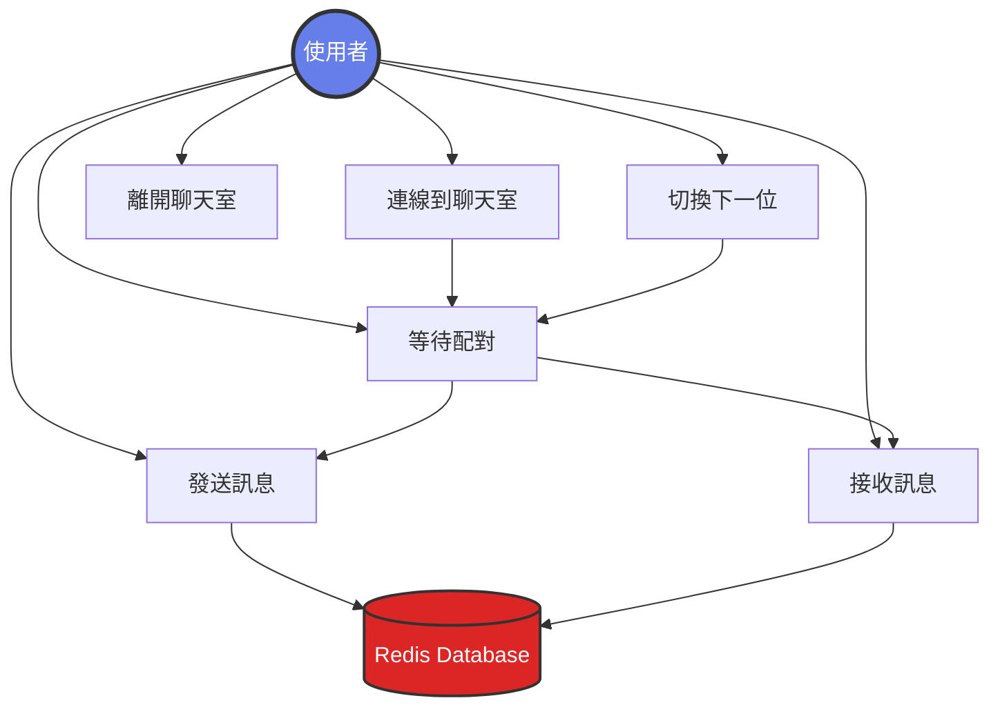
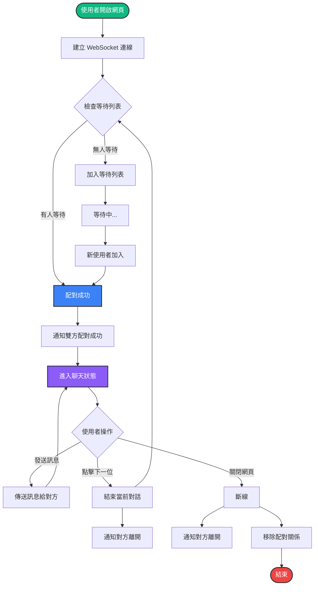
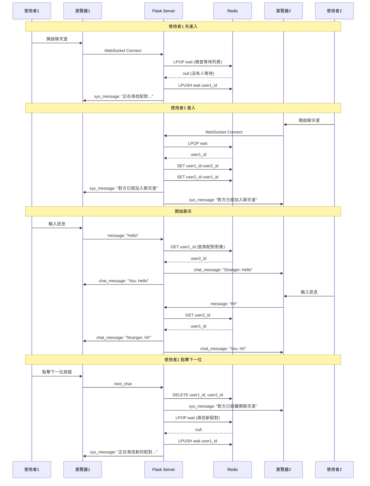
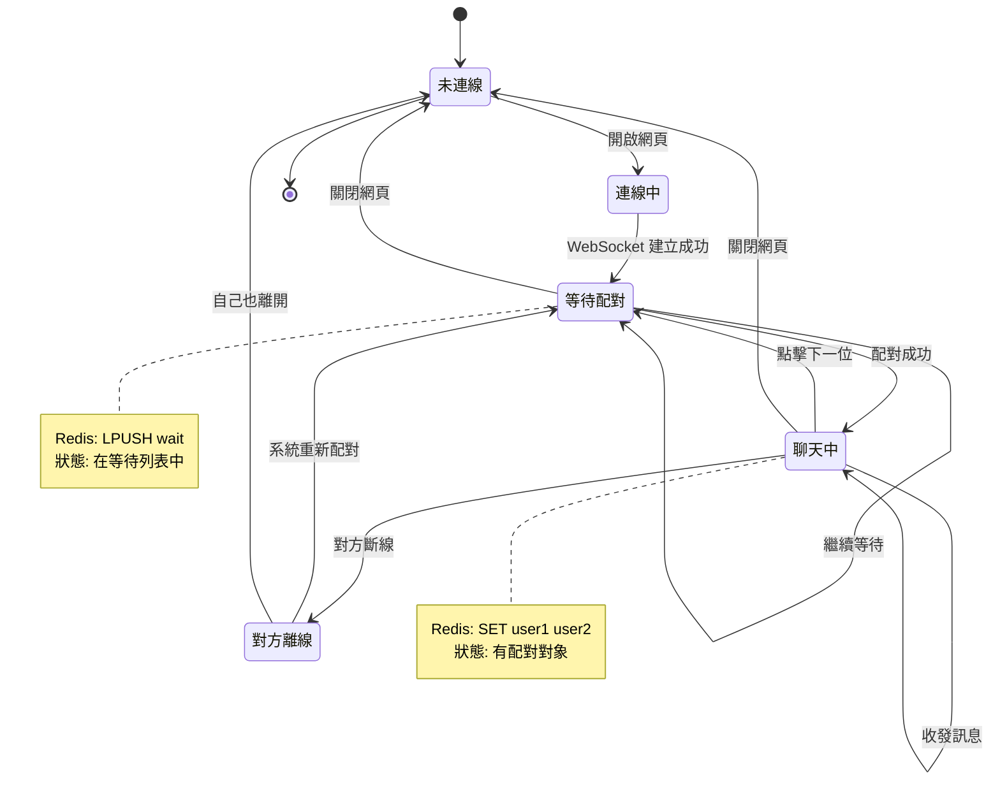
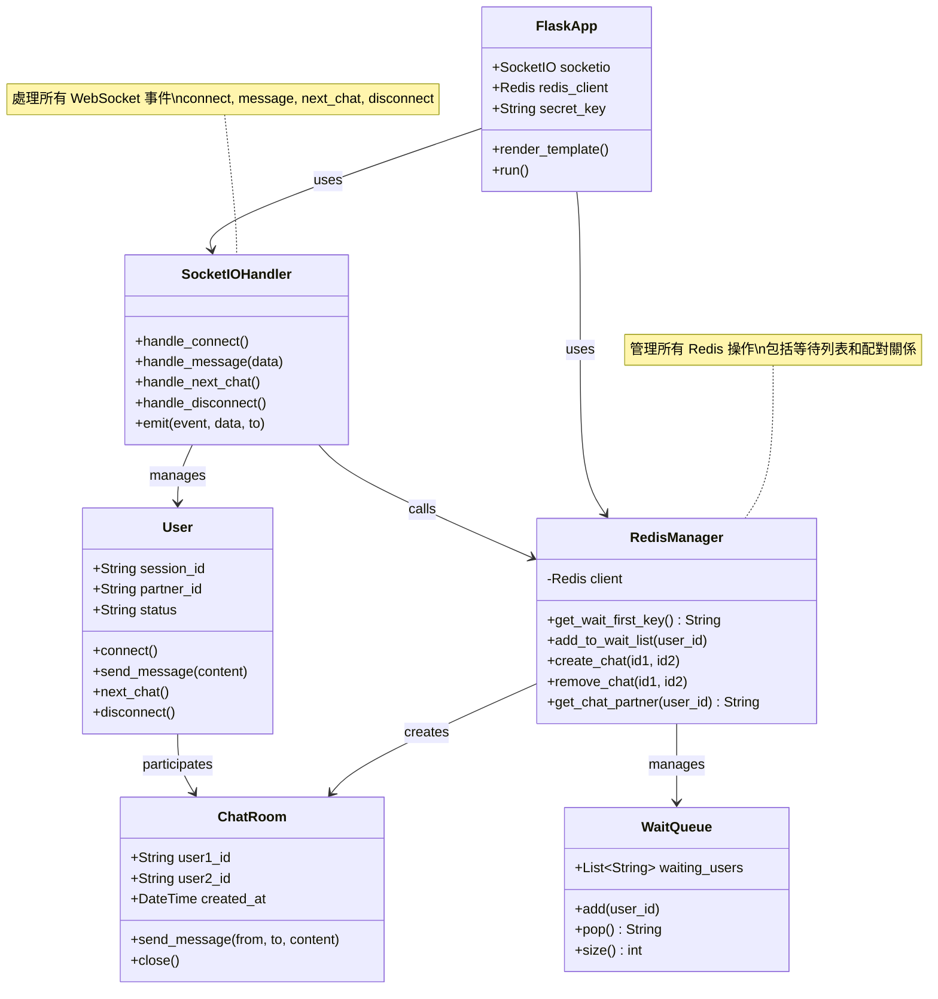
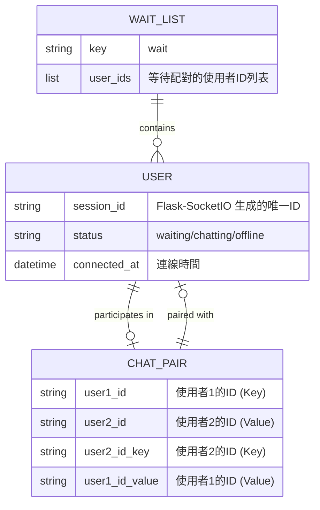

# 🎲 隨機一對一匿名聊天室

一個基於 Flask + Socket.IO + Redis 的即時匿名聊天室，使用者可以隨機配對並進行一對一對話。

## 📋 目錄

- [UML 系統設計圖](#uml-系統設計圖)
  - [用例圖 (Use Case Diagram)](#用例圖-use-case-diagram)
  - [活動圖 (Activity Diagram)](#活動圖-activity-diagram)
  - [循序圖 (Sequence Diagram)](#循序圖-sequence-diagram)
  - [狀態圖 (State Diagram)](#狀態圖-state-diagram)
  - [部署圖 (Deployment Diagram)](#部署圖-deployment-diagram)
- [系統架構](#系統架構)
- [功能特色](#功能特色)
- [技術堆疊](#技術堆疊)
- [環境需求](#環境需求)
- [安裝步驟](#安裝步驟)
- [設定說明](#設定說明)
- [執行方式](#執行方式)
- [專案結構](#專案結構)
- [使用說明](#使用說明)

---

## 📊 UML 系統設計圖

### 用例圖 (Use Case Diagram)

展示系統的主要使用者及其可執行的操作。



### 活動圖 (Activity Diagram)

展示使用者從連線到聊天的完整流程。



### 循序圖 (Sequence Diagram)

展示兩個使用者配對和聊天的互動時序。



### 狀態圖 (State Diagram)

展示使用者連線的各種狀態轉換。



### 類別圖 (Class Diagram)

展示系統的主要類別結構和關係。



### 實體關聯圖 (ER Diagram)

展示 Redis 中的資料結構關係。



---

## 🏗️ 系統架構

```
┌─────────────┐         WebSocket          ┌─────────────┐
│   Browser   │ ◄────────────────────────► │   Flask     │
│  (Client)   │      Socket.IO 4.0         │   Server    │
└─────────────┘                            └──────┬──────┘
                                                   │
                                                   │ Redis Client
                                                   │
                                            ┌──────▼──────┐
                                            │    Redis    │
                                            │   Database  │
                                            └─────────────┘
```

### 架構說明

1. **前端（Client）**
   - 使用 jQuery 操作 DOM
   - Socket.IO Client 處理 WebSocket 連線
   - 響應式 UI 設計

2. **後端（Flask Server）**
   - Flask 作為 Web 框架
   - Flask-SocketIO 處理 WebSocket 通訊
   - Eventlet 提供非同步支援

3. **資料庫（Redis）**
   - 儲存等待配對的使用者列表（List）
   - 儲存配對關係（Key-Value）
   - 快速的讀寫效能

---

## ✨ 功能特色

- ✅ **即時配對**：自動匹配在線使用者
- ✅ **匿名聊天**：無需註冊，保護隱私
- ✅ **雙向通訊**：WebSocket 即時訊息傳送
- ✅ **下一位功能**：隨時切換聊天對象
- ✅ **系統通知**：配對成功/離開提示
- ✅ **現代化 UI**：美觀的漸層背景與氣泡對話框

---

## 🛠️ 技術堆疊

### 後端
- **Python 3.8+**
- **Flask 3.0.0** - Web 框架
- **Flask-SocketIO 5.3.5** - WebSocket 處理
- **Redis 5.0.1** - 資料庫客戶端
- **Eventlet 0.33.3** - 非同步伺服器
- **python-dotenv 1.0.0** - 環境變數管理

### 前端
- **jQuery 3.6.0** - DOM 操作
- **Socket.IO Client 4.0.1** - WebSocket 客戶端
- **HTML5 + CSS3** - 介面設計

### 資料庫
- **Redis** - 記憶體資料庫

---

## 📦 環境需求

- Python 3.8 或以上版本
- Redis 資料庫（本地或雲端）
- 支援 WebSocket 的現代瀏覽器

---

## 🚀 安裝步驟

### 1. 克隆專案

```bash
git clone <repository-url>
cd chat
```

### 2. 建立虛擬環境（建議）

```bash
# Windows
python -m venv venv
venv\Scripts\activate

# macOS/Linux
python3 -m venv venv
source venv/bin/activate
```

### 3. 安裝依賴套件

```bash
pip install -r requirements.txt
```

### 4. 設定環境變數

複製 `.env.example` 並重新命名為 `.env`：

```bash
# Windows
copy .env.example .env

# macOS/Linux
cp .env.example .env
```

編輯 `.env` 檔案，填入你的 Redis 連線資訊：

```env
# Redis 連線設定
REDIS_HOST=your-redis-host.com
REDIS_PORT=6379
REDIS_USERNAME=default
REDIS_PASSWORD=your-password-here

# Flask 設定
FLASK_SECRET_KEY=your-secret-key-here
FLASK_PORT=5000
FLASK_DEBUG=True
```

---

## ⚙️ 設定說明

### 環境變數說明

| 變數名稱           | 說明             | 預設值  | 必填 |
| ------------------ | ---------------- | ------- | ---- |
| `REDIS_HOST`       | Redis 伺服器位址 | -       | ✅    |
| `REDIS_PORT`       | Redis 連接埠     | 6379    | ✅    |
| `REDIS_USERNAME`   | Redis 使用者名稱 | default | ❌    |
| `REDIS_PASSWORD`   | Redis 密碼       | -       | ✅    |
| `FLASK_SECRET_KEY` | Flask 密鑰       | secret! | ❌    |
| `FLASK_PORT`       | Flask 伺服器埠號 | 5000    | ❌    |
| `FLASK_DEBUG`      | 開發模式         | True    | ❌    |

### Redis 設定

#### 本地 Redis

如果使用本地 Redis：

```env
REDIS_HOST=localhost
REDIS_PORT=6379
REDIS_USERNAME=default
REDIS_PASSWORD=
```

#### 雲端 Redis

如果使用 Redis Cloud、AWS ElastiCache 等雲端服務，請填入對應的連線資訊。

---

## ▶️ 執行方式

### 1. 確保 Redis 已啟動

**本地 Redis：**
```bash
# Windows (使用 Redis Windows 版本)
redis-server

# macOS (使用 Homebrew)
brew services start redis

# Linux
sudo systemctl start redis
```

**雲端 Redis：** 確保服務正常運行

### 2. 啟動 Flask 應用

```bash
python app.py
```

看到以下訊息表示啟動成功：

```
Redis 連線成功
 * Running on http://127.0.0.1:5000
```

### 3. 開啟瀏覽器測試

開啟兩個瀏覽器分頁，分別訪問：

```
http://127.0.0.1:5000
```

兩個分頁會自動配對，即可開始聊天！

---

## 📁 專案結構

```
chat/
├── app.py                 # Flask 主程式
├── requirements.txt       # Python 依賴套件
├── .env                   # 環境變數（不納入版控）
├── .env.example          # 環境變數範本
├── .gitignore            # Git 忽略檔案
├── README.md             # 專案說明文件
└── templates/
    └── index.html        # 前端頁面
```

### 檔案說明

- **`app.py`**: 後端主程式
  - 初始化 Flask 和 SocketIO
  - 處理 WebSocket 事件（connect, message, next_chat, disconnect）
  - Redis 資料操作（配對邏輯）

- **`templates/index.html`**: 前端介面
  - Socket.IO 客戶端連線
  - 訊息發送與接收
  - UI 互動邏輯

- **`.env`**: 環境變數配置
  - Redis 連線資訊
  - Flask 應用設定

---

## 📖 使用說明

### 基本使用流程

1. **開啟網頁**
   - 訪問 `http://127.0.0.1:5000`
   - 系統自動連線並顯示「正在尋找配對...」

2. **配對成功**
   - 當另一位使用者上線時
   - 雙方會看到「對方已經加入聊天室」
   - 即可開始對話

3. **發送訊息**
   - 在輸入框輸入訊息
   - 按下「發送」或按 Enter 鍵
   - 訊息會即時傳送給對方

4. **切換對象**
   - 點擊「下一位 (Next)」按鈕
   - 結束當前對話
   - 自動尋找新的配對

5. **離開聊天**
   - 關閉瀏覽器分頁
   - 對方會收到「對方已經離開聊天室」通知

### WebSocket 事件說明

| 事件名稱       | 方向            | 說明           |
| -------------- | --------------- | -------------- |
| `connect`      | Client → Server | 使用者連線     |
| `sys_message`  | Server → Client | 系統通知訊息   |
| `message`      | Client → Server | 發送聊天訊息   |
| `chat_message` | Server → Client | 接收聊天訊息   |
| `next_chat`    | Client → Server | 請求下一位配對 |
| `disconnect`   | Client → Server | 使用者斷線     |

---

## 🔍 Redis 資料結構

### 1. 等待列表（List）

```
Key: "wait"
Type: List
Value: [user_id_1, user_id_2, ...]
```

### 2. 配對關係（String）

```
Key: user_id_1
Type: String
Value: user_id_2

Key: user_id_2
Type: String
Value: user_id_1
```

### 資料操作

- **LPUSH**: 將使用者加入等待列表尾端
- **LPOP**: 取出等待列表第一位使用者
- **SET**: 建立配對關係
- **GET**: 查詢配對對象
- **DEL**: 刪除配對關係

---

## 🐛 除錯指南

### Redis 連線失敗

```
Redis 連線失敗: Error connecting to Redis
```

**解決方法：**
1. 檢查 Redis 服務是否啟動
2. 確認 `.env` 中的連線資訊正確
3. 檢查防火牆設定

### 無法配對

**可能原因：**
- 只有一個使用者在線
- Redis 等待列表有問題

**解決方法：**
```bash
# 清空 Redis 等待列表
redis-cli
> DEL wait
```

### WebSocket 連線失敗

**解決方法：**
1. 檢查瀏覽器是否支援 WebSocket
2. 確認防火牆沒有阻擋 WebSocket 連線
3. 檢查 CORS 設定

---

## 📝 開發筆記

### 與 Go 版本的差異

1. **Session ID 管理**
   - Go: 手動生成 UUID
   - Python: 使用 Flask-SocketIO 的 `request.sid`

2. **訊息廣播**
   - Go: 廣播後由客戶端過濾
   - Python: 使用 `to=user_id` 直接指定接收者

3. **環境變數**
   - 使用 `python-dotenv` 管理
   - 敏感資訊不直接寫在程式碼中

---

## 📄 授權

MIT License

---

## 🤝 貢獻

歡迎提交 Issue 或 Pull Request！

---

## 📧 聯絡方式

如有問題，請透過 Issue 聯繫。
